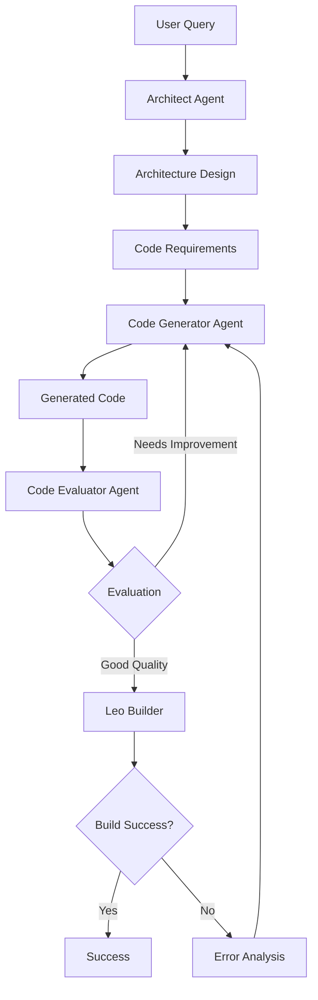

# 🔥 LeoForge

<div align="center">


**AI-Powered Leo Smart Contract Generator for Aleo Blockchain**

[Features](#features) • [Installation](#installation) • [Usage](#usage) • [Architecture](#architecture) • [Examples](#examples)

</div>

---

## 🌟 Overview

LeoForge is an advanced AI-powered code generation framework specifically designed for creating Leo smart contracts on the Aleo blockchain. It leverages multiple AI agents working in concert to analyze requirements, generate code, evaluate quality, and iteratively improve until a compilable, production-ready smart contract is produced.

## ✨ Features

- **🤖 Multi-Agent Architecture**: Specialized AI agents for different aspects of code generation
  - **Architect Agent**: Analyzes requirements and designs project architecture
  - **Code Generator Agent**: Generates Leo code based on specifications
  - **Code Evaluator Agent**: Reviews code for completeness, security, and optimization
  
- **🔄 Iterative Improvement**: Automatic compilation, error detection, and correction loop
- **🎨 Rich Console Interface**: Beautiful CLI with progress tracking and formatted output
- **📊 Comprehensive Feedback**: Detailed evaluation scores and improvement suggestions
- **🚀 Project Templates**: Support for various project types (Token, NFT, DeFi, Games, etc.)
- **🛡️ Security Focus**: Built-in security analysis and best practices enforcement

## 📋 Requirements

- Python 3.8 or higher
- Leo CLI (for compilation)
- API key for AI model access (Claude/OpenAI)

## 🚀 Installation

1. **Clone the repository**
   ```bash
   git clone https://github.com/yourusername/LeoForge.git
   cd LeoForge
   ```

2. **Create virtual environment**
   ```bash
   python -m venv venv
   source venv/bin/activate  # On Windows: venv\Scripts\activate
   ```

3. **Install dependencies**
   ```bash
   pip install -r requirements.txt
   ```

4. **Set up environment variables**
   ```bash
   export ANTHROPIC_API_KEY="your-api-key"
   # or
   export OPENAI_API_KEY="your-api-key"
   ```

## 📖 Usage

### Interactive Mode (Recommended)

Simply run LeoForge without arguments for an interactive experience:

```bash
python main.py generate
```

### Command Line Mode

Generate a project with a single command:

```bash
# Generate a token project
python main.py generate "Create an ERC20-like token with mint, burn, and transfer functions" --type token

# Generate with custom iterations
python main.py generate "Build a DAO voting system" --iterations 3

# Non-interactive mode
python main.py generate "Create a lottery contract" --no-interactive
```

### Available Commands

- `generate` - Generate a new Leo project
- `examples` - Show example project queries
- `version` - Display version information

### Command Options

- `--type, -t` - Specify project type (token, nft, defi, game, oracle, custom)
- `--iterations, -i` - Maximum generation iterations (default: 5)
- `--interactive/--no-interactive` - Toggle interactive mode

## 🏗️ Architecture

### Workflow Overview



### Agent Responsibilities

1. **Architect Agent**
   - Analyzes natural language requirements
   - Identifies project type and features
   - Designs data structures and functions
   - Considers security implications

2. **Code Generator Agent**
   - Transforms requirements into Leo code
   - Implements all specified features
   - Follows Leo syntax and best practices
   - Handles compilation error fixes

3. **Code Evaluator Agent**
   - Assesses code completeness
   - Identifies security vulnerabilities
   - Suggests optimizations
   - Provides quality score (0-100)

### Project Structure

```
LeoForge/
├── src/
│   ├── agents/          # AI agents
│   │   ├── architect.py
│   │   ├── code_generator.py
│   │   └── code_evaluator.py
│   ├── services/        # Core services
│   │   └── builder.py
│   ├── workflow/        # Orchestration
│   │   └── orchestrator.py
│   ├── models.py        # Data models
│   └── cli.py          # CLI interface
├── main.py             # Entry point
├── requirements.txt
└── README.md
```

## 📚 Examples

### Token Project
```bash
python main.py generate "Create a governance token with voting power, delegation, and time-locked vesting"
```

### NFT Collection
```bash
python main.py generate "Build an NFT marketplace with minting, royalties, and auction functionality" --type nft
```

### DeFi Protocol
```bash
python main.py generate "Implement a lending protocol with collateral, liquidation, and interest rates" --type defi
```

### Gaming Contract
```bash
python main.py generate "Create a battle royale game with player stats, loot boxes, and tournaments" --type game
```

## 🎯 Output Example

```
🚀 LeoForge Project Generation
Query: Create a simple token with mint and transfer functions

🏗️  Designing architecture...
✓ Architecture design complete

╭─ Project Architecture ──────────────────────────────────────╮
│ Component         Details                                   │
├─────────────────────────────────────────────────────────────┤
│ Project Name      simple_token                              │
│ Type              token                                     │
│ Features          • Mint new tokens                         │
│                   • Transfer tokens between addresses       │
│                   • Check balance                           │
│                   • Burn tokens                             │
│ Data Structures   • Token: record with owner and amount     │
│ Transitions       • mint: (address, u64) -> Token           │
│                   • transfer: (Token, address, u64) -> Token│
╰─────────────────────────────────────────────────────────────╯

✓ Workspace created: /home/user/simple_token

🔄 Iteration 1/5
  Generating initial code...
  Evaluating code quality...
  Building project...

╭─ Iteration 1 Results ───────────────────────────────────────╮
│ Metric              Value                                    │
├─────────────────────────────────────────────────────────────┤
│ Code Quality Score  92.5/100                                 │
│ Complete            ✓                                        │
│ Has Errors          ✓                                        │
│ Build Status        success                                  │
│ Build Time          2.34s                                    │
│ Duration            8.67s                                    │
╰─────────────────────────────────────────────────────────────╯

🎉 Success! Project built successfully in 1 iteration(s)

✨ Project Generation Complete! ✨
```

## 🤝 Contributing

Contributions are welcome! Please feel free to submit a Pull Request.

1. Fork the repository
2. Create your feature branch (`git checkout -b feature/AmazingFeature`)
3. Commit your changes (`git commit -m 'Add some AmazingFeature'`)
4. Push to the branch (`git push origin feature/AmazingFeature`)
5. Open a Pull Request

## 📄 License

This project is licensed under the MIT License - see the [LICENSE](LICENSE) file for details.

## 🙏 Acknowledgments

- Aleo team for the Leo programming language
- Anthropic/OpenAI for AI models
- Rich library for the beautiful console interface

---

<div align="center">
Made with ❤️ for the Aleo ecosystem
</div> 