<div align="center">

# ⚡ LeoForge

</div>

<div align="center">


**AI-Powered Leo Smart Contract Generator for Aleo Blockchain**

*Transform your ideas into production-ready Leo smart contracts with the power of artificial intelligence*

[Features](#features) • [Quick Start](#quick-start) • [Architecture](#architecture) • [Documentation](#documentation) • [Roadmap](#roadmap)

</div>

---

## Overview

**LeoForge** is a revolutionary AI-powered code generation framework specifically designed for creating Leo smart contracts on the Aleo blockchain. It leverages cutting-edge language models and a sophisticated multi-agent architecture to transform natural language descriptions into compilable, secure, and optimized Leo smart contracts.

### Key Highlights

- **Multi-Agent AI System**: Specialized AI agents working in perfect harmony
- **Iterative Refinement**: Automatic compilation, error detection, and intelligent correction
- **Security-First**: Built-in security analysis and best practices enforcement
- **Dual Interface**: Rich CLI and beautiful Web UI (Streamlit)
- **Learning System**: Analyzes errors and improves future generations
- **Production Ready**: Generates deployable, tested smart contracts

## ✨ Features

### Multi-Agent Architecture
- **Architect Agent**: Analyzes requirements and designs optimal project architecture
- **Code Generator Agent**: Generates high-quality Leo code with best practices
- **Code Evaluator Agent**: Reviews code for completeness, security, and optimization
- **Rule Engineer Agent**: Learns from errors and creates improvement rules

### Intelligent Workflow
- **Iterative Improvement**: Automatic compilation and error correction loop
- **Smart Error Analysis**: AI-powered error diagnosis and fixing
- **Quality Assurance**: Comprehensive code evaluation with scoring
- **Build Integration**: Direct Leo CLI integration for testing

### Rich User Experience
- **Beautiful CLI**: Rich console interface with progress tracking
- **Web Interface**: Modern Streamlit-based web application
- **Real-time Feedback**: Live progress updates and detailed results
- **Project Management**: Automatic workspace creation and organization

### Security & Quality
- **Security Analysis**: Built-in vulnerability detection
- **Best Practices**: Enforced Leo coding standards
- **Code Review**: AI-powered code quality assessment
- **Testing Integration**: Automatic test generation and execution

## 🚀 Quick Start

### Prerequisites

Before you begin, ensure you have the following installed:

- **Python 3.8+** - [Download Python](https://www.python.org/downloads/)
- **Leo CLI** - [Install Leo](https://developer.aleo.org/leo/installation)
- **Git** - [Download Git](https://git-scm.com/downloads)
- **AI API Key** - Get from [Anthropic](https://console.anthropic.com/) or [OpenAI](https://platform.openai.com/)

### Installation

1. **Clone the repository**
   ```bash
   git clone https://github.com/yourusername/LeoForge.git
   cd LeoForge
   ```

2. **Install Python virtual environment support** (if needed)
   ```bash
   # Ubuntu/Debian
   sudo apt update && sudo apt install python3-venv
   
   # CentOS/RHEL/Fedora
   sudo yum install python3-venv  # or dnf install python3-venv
   
   # macOS (usually included with Python)
   # Windows (included with Python installation)
   ```

3. **Create and activate virtual environment**
   ```bash
   # Linux/macOS
   python3 -m venv venv
   source venv/bin/activate

   # Windows (Command Prompt)
   python -m venv venv
   venv\Scripts\activate
   
   # Windows (PowerShell)
   python -m venv venv
   venv\Scripts\Activate.ps1
   ```

4. **Install dependencies**
   ```bash
   pip install -r requirements.txt
   ```

5. **Set up environment variables**
   ```bash
   # Copy the example environment file
   cp .env.example .env
   
   # Edit .env and add your API keys
   ANTHROPIC_API_KEY=your-anthropic-api-key-here
   # OR
   OPENAI_API_KEY=your-openai-api-key-here
   
   # Optional: Custom admin address for generated contracts
   ADMIN_ADDRESS=aleo1your_admin_address_here
   ```

6. **Verify Leo CLI installation**
   ```bash
   leo --version
   ```

### Alternative: Quick Setup Script

Or use the automatic setup script for easier installation:

```bash
# Make the script executable
chmod +x launch.sh

# Launch LeoForge (automatically configures environment)
./launch.sh generate

# For web interface
./launch.sh
```

The `launch.sh` script automatically handles:
- Creating virtual environment if it doesn't exist
- Activating it
- Installing dependencies if needed
- Checking Leo CLI presence
- Launching the application

### Usage Options

#### Command Line Interface (CLI)

**Interactive Mode** (Recommended for beginners):
```bash
python main.py generate
```

**Direct Command Mode**:
```bash
# Generate a token with specific type
python main.py generate "Create a governance token with voting and delegation" --type token

# Custom iterations and non-interactive mode
python main.py generate "Build a DeFi lending protocol" --iterations 3 --no-interactive
```

**View Examples**:
```bash
python main.py examples
```

**Manage Configuration**:
```bash
# View current configuration
python main.py config

# Update admin address
python main.py config --set-admin aleo1your_new_admin_address
```

**Rule Management** (Learning System):
```bash
# Analyze logs and generate improvement rules
python main.py analyze-logs

# View generated rules
python main.py rules

# Export rules
python main.py rules --export my_rules.json
```

#### Web Interface (Streamlit)

Launch the beautiful web interface:
```bash
streamlit run app.py
```

Or use the convenient launcher script:
```bash
./launch.sh
```

Then open your browser to `http://localhost:8501`

## 🏗️ Architecture

### Workflow Diagram

```mermaid
graph TB
    %% Styles pour les sous-graphes avec des couleurs modernes et vibrantes
    classDef ui fill:#4A90E2,stroke:#2E5C8A,stroke-width:3px,color:#FFFFFF,font-size:16px,font-weight:bold;
    classDef core fill:#FF6B6B,stroke:#C44545,stroke-width:3px,color:#FFFFFF,font-size:16px,font-weight:bold;
    classDef agent fill:#4ECDC4,stroke:#2A7A76,stroke-width:3px,color:#FFFFFF,font-size:16px,font-weight:bold;
    classDef services fill:#FFD93D,stroke:#CCB030,stroke-width:3px,color:#333333,font-size:16px,font-weight:bold;
    classDef storage fill:#95E1D3,stroke:#5CA89C,stroke-width:3px,color:#2C3E50,font-size:16px,font-weight:bold;
    
    %% Styles pour les nœuds individuels avec effets de dégradé
    classDef nodeUI fill:#5BA3F5,stroke:#3D7FCC,stroke-width:2px,color:#FFFFFF,font-weight:bold,font-size:14px;
    classDef nodeCore fill:#FF8787,stroke:#E55555,stroke-width:2px,color:#FFFFFF,font-weight:bold,font-size:14px;
    classDef nodeAgent fill:#6FE5DD,stroke:#4BA8A2,stroke-width:2px,color:#FFFFFF,font-weight:bold,font-size:14px;
    classDef nodeServices fill:#FFE066,stroke:#E5C252,stroke-width:2px,color:#2C3E50,font-weight:bold,font-size:14px;
    classDef nodeStorage fill:#A8EDEA,stroke:#70BDB8,stroke-width:2px,color:#2C3E50,font-weight:bold,font-size:14px;
    
    subgraph "🖥️ User Interface"
        A[Web UI<br/>🌐 Streamlit]
        B[CLI<br/>💻 Rich Console]
    end
    class A,B nodeUI;
    
    subgraph "🎯 Core Orchestration"
        C[Project Orchestrator<br/>🔄 Workflow Management]
    end
    class C nodeCore;
    
    subgraph "🤖 AI Agent Layer"
        D[Architect Agent<br/>🏗️ Architecture Design]
        E[Code Generator<br/>⚡ Leo Code Generation]
        F[Code Evaluator<br/>✅ Quality Assessment]
        G[Rule Engineer<br/>🧠 Learning & Rules]
    end
    class D,E,F,G nodeAgent;
    
    subgraph "⚙️ Services Layer"
        H[Leo Builder<br/>🔨 Compilation Service]
        I[Workspace Manager<br/>📁 Project Management]
        J[Logger Service<br/>📊 Error Tracking]
        K[Rule Manager<br/>📚 Knowledge Base]
    end
    class H,I,J,K nodeServices;
    
    subgraph "💾 Storage & Output"
        L[Generated Code<br/>📝 Leo Smart Contracts]
        M[Project Logs<br/>🔍 Error Analysis]
        N[Improvement Rules<br/>💡 Learning Database]
        O[Compiled Output<br/>🚀 Deployable Contracts]
    end
    class L,M,N,O nodeStorage;
    
    %% User Interface Flow
    A -.->|User Input| C
    B -.->|CLI Commands| C
    
    %% Core Agent Workflow
    C ==>|Initiates| D
    D ==>|Design Ready| E
    E ==>|Code Generated| F
    F ==>|Quality Report| G
    
    %% Service Integration
    C -->|Manages| H
    C -->|Organizes| I
    C -->|Tracks| J
    G -->|Updates| K
    
    %% Feedback Loops avec styles différents
    F -.->|🔄 Needs Improvement| E
    H -.->|❌ Build Errors| E
    G -.->|✨ New Rules| D
    G -.->|📈 New Rules| E
    
    %% Output Generation
    E -->|Generates| L
    J -->|Records| M
    G -->|Creates| N
    H -->|Compiles| O
    
    %% Styles additionnels pour les flèches
    linkStyle 0,1 stroke:#4A90E2,stroke-width:2px
    linkStyle 2,3,4,5 stroke:#FF6B6B,stroke-width:3px
    linkStyle 6,7,8,9 stroke:#FFD93D,stroke-width:2px
    linkStyle 10,11,12,13 stroke:#4ECDC4,stroke-width:2px,stroke-dasharray: 5 5
    linkStyle 14,15,16,17 stroke:#95E1D3,stroke-width:2px
```



### Agent Responsibilities

| Agent | Role | Key Functions |
|-------|------|---------------|
| **Architect** | System Designer | • Analyzes natural language requirements<br/>• Designs optimal data structures<br/>• Plans contract architecture<br/>• Considers security implications |
| **Code Generator** | Code Creator | • Transforms requirements into Leo code<br/>• Implements all specified features<br/>• Follows Leo syntax and best practices<br/>• Handles compilation error fixes |
| **Code Evaluator** | Quality Assessor | • Evaluates code completeness<br/>• Identifies security vulnerabilities<br/>• Suggests optimizations<br/>• Provides quality scores (1-10) |
| **Rule Engineer** | Learning System | • Analyzes error patterns<br/>• Creates improvement rules<br/>• Builds knowledge base<br/>• Enhances future generations |

### Iterative Improvement Process

1. **Requirement Analysis**: Architect Agent processes user input
2. **Architecture Design**: Creates optimal contract structure
3. **Code Generation**: Generates initial Leo smart contract
4. **Quality Evaluation**: Assesses code quality and completeness
5. **Compilation Test**: Attempts to build with Leo CLI
6. **Iterative Refinement**: Fixes errors and improves code
7. **Final Validation**: Produces deployable contract

### Advanced Features

#### Rule Learning System

LeoForge includes an intelligent learning system that analyzes errors and creates improvement rules:

```bash
# Analyze error logs and generate rules
python main.py analyze-logs

# View generated rules
python main.py rules

# Export rules for sharing
python main.py rules --export team_rules.json
```

#### Configuration Management

```bash
# View current configuration
python main.py config

# Update admin address for contracts
python main.py config --set-admin aleo1your_admin_address

# View admin-specific settings
python main.py config --admin
```

#### Project Analytics

Every generation run is logged and analyzed:

- **Error Tracking**: Comprehensive error logging and analysis
- **Performance Metrics**: Build times, iteration counts, success rates
- **Quality Scores**: AI-powered code quality assessment
- **Improvement Suggestions**: Actionable recommendations

## 📋 Roadmap

### Current Version (v1.0.0)
- ✅ Multi-agent AI architecture
- ✅ CLI and web interfaces
- ✅ Leo compilation integration
- ✅ Rule learning system
- ✅ Error analysis and correction
- ✅ Project type support (Token, NFT, DeFi, Game, Oracle)

### Next Release (v1.1.0) - Q2 2024
- **Enhanced AI Models**: Support for latest Claude and GPT models
- **Testing Framework**: Automatic test generation for generated contracts
- **Template System**: Pre-built templates for common contract patterns
- **Security Auditing**: Advanced security analysis with vulnerability scoring
- **Documentation Generation**: Automatic README and API documentation
- **Multi-language Support**: Support for additional programming languages

### Future Releases (v2.0.0+) - 2024
- **Multi-contract Projects**: Support for complex, interconnected contract systems
- **Collaboration Features**: Team workspaces and shared rule databases
- **UI/UX Improvements**: Enhanced web interface with visual contract designer
- **Analytics Dashboard**: Comprehensive project analytics and insights
- **CI/CD Integration**: GitHub Actions and automated deployment workflows
- **Cloud Deployment**: Hosted version with API access
- **Plugin System**: Extensible architecture for custom agents and tools
- **Mobile App**: Mobile interface for contract generation and management

### Long-term Vision
- **Advanced AI Integration**: Custom-trained models for Leo-specific code generation
- **Enterprise Features**: Advanced team management and enterprise security
- **Ecosystem Integration**: Deep integration with Aleo ecosystem tools
- **Market Intelligence**: Smart contract analytics and market insights
- **Predictive Analysis**: AI-powered performance and security predictions

## Contributing

We welcome contributions from the community! Here's how you can help:

### Bug Reports
Found a bug? Please open an issue with:
- Detailed description of the problem
- Steps to reproduce
- Expected vs actual behavior
- Environment details (OS, Python version, etc.)

### Feature Requests
Have an idea? We'd love to hear it! Please include:
- Clear description of the feature
- Use cases and benefits
- Implementation suggestions (if any)

### Development

1. **Fork the repository**
2. **Create a feature branch**: `git checkout -b feature/amazing-feature`
3. **Make your changes** and add tests
4. **Ensure tests pass**: `pytest`
5. **Commit your changes**: `git commit -m 'Add amazing feature'`
6. **Push to the branch**: `git push origin feature/amazing-feature`
7. **Open a Pull Request**

### Development Guidelines
- Follow PEP 8 style guidelines
- Add type hints for all functions
- Include docstrings for public methods
- Write tests for new features
- Update documentation as needed

## License

This project is licensed under the MIT License - see the [LICENSE](LICENSE) file for details.

## Acknowledgments

- **Aleo Team** - For creating the innovative Leo programming language
- **Anthropic & OpenAI** - For providing powerful AI models
- **Rich Library** - For the beautiful console interface
- **Streamlit** - For the amazing web framework
- **Open Source Community** - For inspiration and contributions

---

<div align="center">

**Made with ❤️ for the Aleo Ecosystem**

*Transform your blockchain ideas into reality with LeoForge*

[⭐ Star us on GitHub](https://github.com/yourusername/LeoForge) • [📖 Documentation](https://docs.leoforge.dev) • [💬 Discord](https://discord.gg/leoforge)

</div>